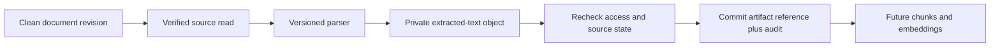

# Learning: from a document to reliable AI input

An AI answer is only as traceable as the input that produced it. SuitsFlow is
building that input pipeline before adding embeddings, retrieval or LLM calls.

## What already exists

A document has immutable numbered revisions. Upload verifies size and SHA-256,
then quarantines the revision until scanning passes. TXT, DOCX and PDF parsers
produce bounded text. PDF parsing runs in a separate Linux process with resource
limits because file size alone does not bound decompression or parsing cost.

## What this slice adds

Previously, GET `/text` parsed the source on every request. POST `/extraction` now
writes the extracted text to private object storage and records its metadata in
PostgreSQL. GET `/extraction` reads and verifies that saved object. Keeping the endpoints
separate makes a read predictable: it does not silently start expensive processing.

The artifact records its source revision/checksum, parser version, output checksum
and creation time. Imagine changing how a DOCX parser handles tables. A new parser
version can produce different text from the same original file. An AI evaluation
must distinguish those inputs instead of silently replacing the earlier result.

## Four engineering ideas to practice

1. **Provenance:** retain enough identifiers to trace an output to its inputs and
   transformation. Later, chunks and embeddings should reference this artifact ID;
   model and prompt versions will add further provenance for generated answers.
2. **Idempotency:** repeating a save request returns the same artifact. A unique
   database constraint is the final guard; a short revision lock serializes the
   decision to insert. Retrying after a network interruption does not create a
   second artifact or audit event.
3. **Transactions:** artifact metadata and audit event commit together. If audit
   insertion fails, neither database record remains. The private object may already
   exist: object storage is outside that transaction and needs reconciliation. Avoid holding a transaction during file I/O: parse
   first, then recheck permissions and source state before publishing.
4. **Tenant isolation:** checking an ID alone is insufficient. Every lookup includes
   tenant identity, and composite foreign keys prevent an artifact from referencing
   another tenant's revision or the wrong source checksum.

These are reliability properties, not proof that extracted text is correct.
Checksums compare bytes; scanners produce limited verdicts; PDF text order can be
ambiguous. Keep extracted text as untrusted data when it reaches an LLM. Do not
interpret instructions inside a document as instructions to the application.

## Read the code in this order

- `src/suitsflow/api/routes/documents.py`: authentication, endpoints and HTTP errors.
- `src/suitsflow/services/saved_extractions.py`: reuse, parse, recheck and commit.
- `src/suitsflow/services/extraction.py`: parser selection and verified source reads.
- `src/suitsflow/db/models.py`: artifact identity and database constraints.
- `migrations/versions/0008_save_document_extractions.py`: schema and immutability trigger.
- `tests/integration/extraction_checks.py`: concurrency, tenant boundaries, unavailable
  storage, immutable records and forced audit rollback.

## Try these experiments

Use the disposable integration tests before experimenting with real data. Compare
the tests for repeated save, concurrent save, member read/admin write and audit
failure. Predict the expected database rows before reading the assertions.

The API explorer at http://127.0.0.1:8000/docs shows request/response schemas.
Protected calls still require configured development identity. AWS is not needed
for the tests; local fake storage isolates the workflow from cloud credentials.

## What comes next

This save operation is synchronous. Durable extraction jobs will expose pending,
running, completed and failed states, with leases and retries as scan jobs already
do. Saved artifacts then become stable input to chunking, embedding and retrieval.
A document-library UI will make these states visible to users. None of those future
features should be confused with this slice's completed persistence layer.

## A distributed-systems lesson

There is no single transaction covering PostgreSQL and object storage. We upload
a new private object first, then publish its reference with the audit in a database
transaction. Only referenced objects are served through the authenticated API.
A failed commit or a losing concurrent request can leave a private orphan object.
Do not blindly delete after a connection error: the commit might have succeeded.
A reconciliation process must compare durable references before cleanup. This is
an ordinary production concern even when the storage account is fully configured;
local mocks let us test these semantics without calling AWS.
